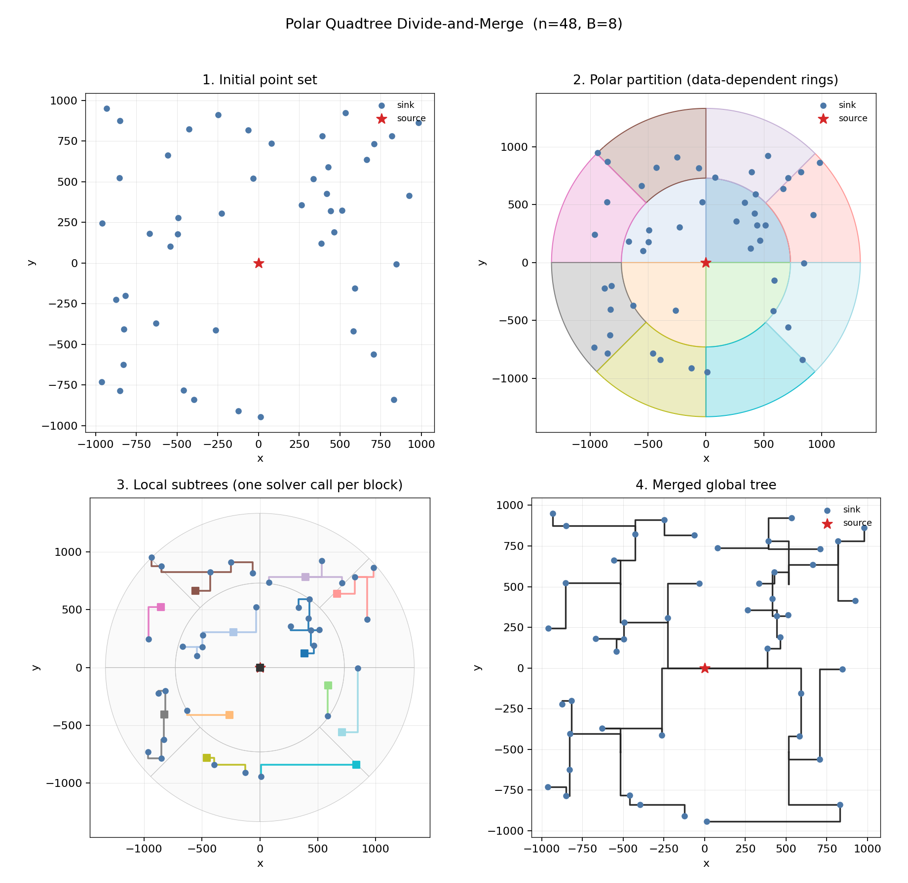

# Towards Timing-Driven Routing: An Efficient Learning Based Geometric Approach

ICCAD 2023 implementation: GNN/RL Actor for moderate-degree nets, plus the **data-dependent polar quadtree divide-and-merge** heuristic for large-degree nets.

Paper: [ICCAD 2023](https://mrsun0.github.io/gwsun.github.io/files/Routing_Wirelength_Timing.pdf)



The figure is a real run with `n=48` pins and block capacity `B=8` (source is the red star at the origin):

1. **Initial point set** — input pins; `points[0]` is the source.
2. **Polar partition** — data-dependent rings (4 / 8 / 16 … sectors); each nonempty block holds at most `B` pins.
3. **Local subtrees** — each block calls the local solver (`points[0]` of that subset is the local source). For moderate blocks this is the Timing-RST Actor; a rectilinear MST is the fallback.
4. **Merged global tree** — bidirectional binary-tree search stitches subtrees into one rectilinear tree.

## Runtime Measurement

The runtimes reported in the paper are measured with the neural network **batch mechanism**, following the evaluation methodology of REST [1]: instead of solving nets one by one, multiple nets are packed into a batch and inferred simultaneously on the GPU. Since the batch size a GPU can process in parallel is much larger than what a CPU can, this batched evaluation preserves the parallel advantage of the learning-based solver.

[1] J. Liu, G. Chen and E. F. Y. Young, "REST: Constructing Rectilinear Steiner Minimum Tree via Reinforcement Learning," 2021 58th ACM/IEEE Design Automation Conference (DAC), San Francisco, CA, USA, 2021, pp. 1135-1140, doi: 10.1109/DAC18074.2021.9586209.

## Layout

| Path | Role |
| --- | --- |
| `models/`, `train_lambda.py`, `train_scratch.py` | Section II Actor-Critic (PyTorch) |
| `inference.py` | Test: `degree<=32` uses Actor batch inference; `degree>32` uses divide-and-merge |
| `utils/divide_merge.py` | Python divide-and-merge (same solver protocol as C++) |
| `utils/nn_solver.py` | Wraps the Actor as `solver(points) -> tree` |
| `algorithms/polar_quadtree/` | C++17 reference implementation of Section III |
| `algorithms/eval.c` | Original GeoSteiner length evaluator |

## Requirements

- PyTorch >= 1.9.0
- C++17 + CMake (only if you build the polar quadtree binaries)

## Train

The model was trained using two GPUs by default, utilizing the DDP module. To initiate the training process, you can use the command `torchrun`.

```shell
sudo env PATH="$PATH" CUDA_VISIBLE_DEVICES=0,1 torchrun --master_port=10002 --nproc_per_node=2 train_lambda.py --degree 10 --batch_size 2048 --weight 0.5
```

- `CUDA_VISIBLE_DEVICES`: GPUs to use
- `master_port`: torchrun port
- `nproc_per_node`: number of GPUs
- `degree`: net degree of the training samples
- `weight`: trade-off `λ` between wirelength and max source–sink path (`R`)

## Test (moderate-degree nets)

Download the well-trained checkpoints from Google Drive into `save/beCalled/`. The default `transform` in `inference.py` is 8; set it to 1 for a faster run.

```shell
python inference.py
python inference.py --degree 30 --weight 0.0 --transform 8
```

If `data/test_data/array_degree*_num*.npy` is missing, random nets are generated.

## Test (large-degree nets, divide-and-merge)

When `--degree` is greater than 32, `inference.py` partitions the net with the polar quadtree and calls the Actor on each block (`B=30` by default, matching the paper). Every solver call uses **index 0 as the source**.

```shell
python inference.py --degree 100 --eval_size 20 --capacity 30 --device cuda:0
```

Without a checkpoint, you can still exercise the skeleton with a rectilinear MST local solver:

```shell
python inference.py --degree 80 --eval_size 5 --capacity 8 --fallback_mst --device cpu
```

## Build the C++ divide-and-merge library

```shell
cmake -S . -B build
cmake --build build
./build/algorithms/polar_quadtree/test_divide_merge
./build/algorithms/polar_quadtree/pqt_demo
```

C++ API (`points[0]` is the global source):

```cpp
#include "polar_quadtree/framework.h"
#include "polar_quadtree/solvers.h"

pqt::Tree my_model(const std::vector<pqt::Point>& pts);  // pts[0] = source
auto tree = pqt::divide_and_merge(pins, my_model, /*capacity=*/30);
```

Python API (same protocol):

```python
from utils.divide_merge import divide_and_merge
from utils.nn_solver import TimingRSTSolver

solver = TimingRSTSolver("save/beCalled/0.0/trst30_0.0b.pt", degree=30)
tree = divide_and_merge(points, solver, capacity=30)
# tree["nodes"], tree["edges"]
```

To regenerate the four-panel figure:

```shell
./build/algorithms/polar_quadtree/dump_viz viz/pipeline.json
python scripts/plot_stages.py
```
